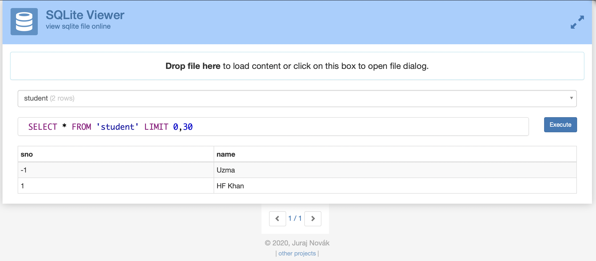

## CONTENTS OF THIS FILE

---

- Introduction
- Model selection
- Setup
- Tech stack used
- Configuration
- App features
- Other resources
- Webapp walk-through
- Installed modules
- Maintainers
- References

## INTRODUCTION

---

> When i first saw the attendance management system as a topic for the Microsoft Engage program, instantly the picture of my professors consuming our whole break to take attendance clicked in my mind.
> Attendance system through face recognition not only automates the entire process and saves time, but it also reduces the chances of unfare advantage and proxy. It can also be further extended to avoid spoof.

## MODEL SELECTION

After my initial open cv model failed to differentiate between me and my sister, i went on a quest to search a better model.
After a bit of research on working of open cv and long discussions with ML enthusiasts resulted in following highlights:

- Open CV uses traditional machine learning algorithms.
- It does not support fine-tuning and training.
- It is generally better to let the algorithms determine the intermediate feature layers than to use algorthims to define them explicitly.
- So we should let the algorithm "learn" to extract the right set of features rather than hand-crafting them and feeding them to an algorithm.

The machine learning pipeline that i used has following features:

1. It performs face detection using MTCNN. And only if one face is detected will the pipeline move ahead.

2. Crop out only the detected face.

3. For Face Recognition,Inception-Resnet was used as a siamese network to compute embedding of the new face and compare its distance from all the face embeddings present in the database to find the closest match. If the distance (p-norm) was under a threshold of 0.8 then the user will be recognised.


---

## SETUP

To run this module on your local device, follow these procedures:

1. Clone this repository by running this command in your terminal/powershell/command prompt
   ```
   git clone https://github.com/uzma024/FaceRec.git
   ```
2. Open the FaceRec folder in vscode and or cd through terminal

3. Now create a virtual environment and activate it
   ```
   python3 -m venv venv (for mac/linux)
   ```
   ```
   . venv/bin/activate  (for mac/linux)
   ```
   or
   ```
   py -3 -m venv venv (for windows)
   ```
   ```
   venv\Scripts\activate  (for windows)
   ```
4. Install the dependencies mentioned in requirement files using conda or pip
   ```
   pip install -r requirements.txt
   ```
5. run the app.py file using
   ```
   python app.py (if you are on windows)
   ```
   or
   ```
   python3 app.py (if you are on linux or mac)
   ```
6. cmd + Click on the link to run app server in the browser

7. To access admin portal, you may use my photo from [database](https://github.com/uzma024/FaceRec/tree/main/database/-1).
---

## TECH STACK USED

- Flask : for route setup, backend.
- HTML, CSS & bootstrap & JavaScript: for front-end
- Sqlite Database for storing student details
- Pytorch - python : for face recognition
- CSV files for storing attendance.

---

## CONFIGURATIONS

- All files and depencies were made/tested/are functional on mac and linux os and visual studio code ide.
- But special care was taken to make the app functional in other configurations too.
- And the testing for same is under progress.

---

## APP FEATURES / FUNCTIONALITIES

- Automation of attendance system.

- High accuracy of face recognition through deep learning models.

- It has dual login setup:

  - Student/Public portal for everyone.
  - It gives students access to enter their roll number in database.
  - It then recognises faces corresponding to the roll number and saves it.
  - Able student to view their details in data base through show database.
  - Student can mark their attendance using Face recognition.
  - Date and time of attendance is also recorded.
  - Check attendance of a particular class using class details like Time and Subject.

- It also has admin portal:

  - Special serial numbers exclusive for admin login.
  - Acess to admin portal is granted using the face recognition.
  - (Spoof detection was not added so judges can access admin portal through photo)

- Admin portal has additional functionalities:

  - Student database access, admin can update names and delete students details from database in just one click.
  - Manual Attendence in-case of emergencies, exceptions etc.

- Attendance management:
  - All of the attendance is added in csv files for easy transfer and management.
  - No need to manually check files, one can check them on portal too.

- Most pages of app are fully responsive and workable on all screen sizes.

---
## OTHER RESOURCES


- [Progess Journal](https://jmistudent-my.sharepoint.com/:x:/g/personal/uzma202000389_st_jmi_ac_in/EYKrSbF08gVBkayFC6bKo0wB26VB3CeR4GBQoCPqgt22hg?e=6szqHL)

- [System Architecture/ER diagram](https://jmistudent-my.sharepoint.com/:b:/g/personal/uzma202000389_st_jmi_ac_in/EdEJQ8exDrtIp3eJ-2QsD9cB34tH4ZnvM-IEPVKCkz-W3A?e=ycl2g0)

- [Youtube Video](https://youtu.be/3iIaFR0SCtg)

---
## Walk Through of Major pages
### Database


### Landing page & capture page


### View option for students


### Invalid roll number in admin login


### Admin Portal & database through admin


### Check Attendance


### When duplicate Roll no is added 


### When face is not authorized


### Student registering with invalid roll number


### Manually marking attendance 


### Checking existing & non-existing attendance file


---

## INSTALLED MODULES

Python 3 will be required for the app to run.
other modules can also be found in [requirements.txt](https://github.com/uzma024/FaceRec/blob/main/requirements.txt)

```
certifi==2022.5.18.1
charset-normalizer==2.0.12
click==8.1.3
cycler==0.11.0
facenet-pytorch==2.5.2
Flask==2.1.2
Flask-SQLAlchemy==2.5.1
fonttools==4.33.3
greenlet==1.1.2
idna==3.3
importlib-metadata==4.11.4
itsdangerous==2.1.2
Jinja2==3.1.2
kiwisolver==1.4.2
MarkupSafe==2.1.1
matplotlib==3.5.2
numpy==1.22.4
opencv-python==4.5.5.64
packaging==21.3
pandas==1.4.2
Pillow==9.1.1
pyparsing==3.0.9
python-dateutil==2.8.2
pytz==2022.1
requests==2.27.1
six==1.16.0
SQLAlchemy==1.4.36
torch==1.11.0
torchvision==0.12.0
typing_extensions==4.2.0
urllib3==1.26.9
Werkzeug==2.1.2
zipp==3.8.0

```

---

## REFERENCES

> For a full description of the face recognition model, visit the project page:
>
> - https://github.com/hashes-jmi/HackJMI2-CheemsGamg
> Siamese network: 
> - https://medium.com/wicds/face-recognition-using-siamese-networks-84d6f2e54ea4

---
## THE PROJECT STATUS
 > Open For Contibution :)
 > For bug fixes/ suggestions open Issues and Pull requests.

 ---
## MAINTAINERS

[@uzma024](https://github.com/uzma024)
